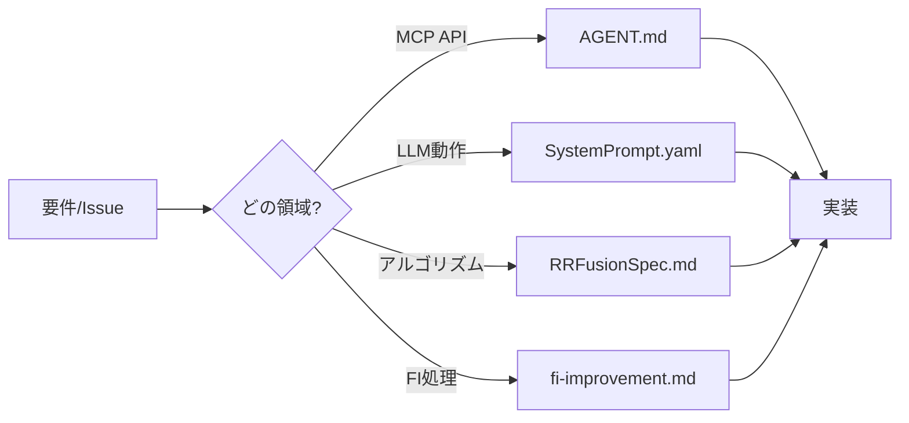
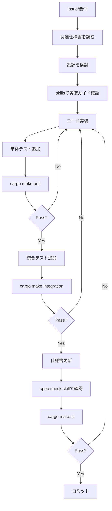
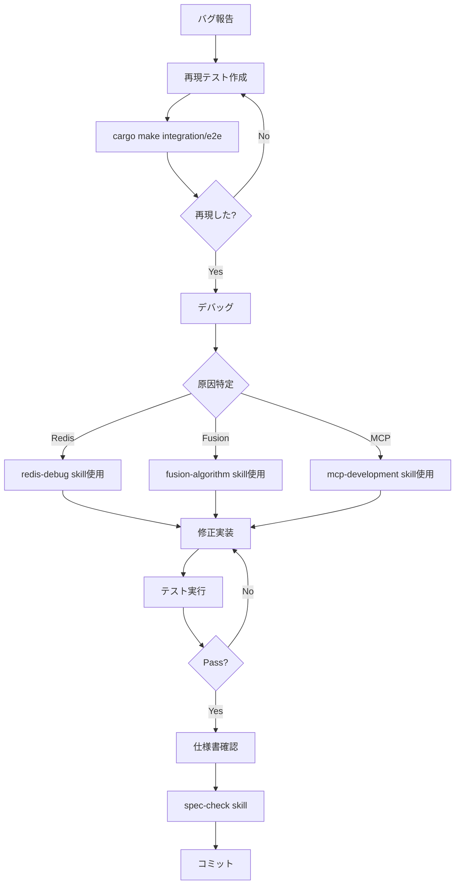

# Claude Codeでの開発ガイド

## 概要

このドキュメントでは、RRFusionプロジェクトをClaude Codeで開発する際のベストプラクティスと推奨ワークフローを説明します。

## プロジェクトの特徴

RRFusionは、Codex(Anthropic社のAI開発ツール)で開発された特許検索システムで、以下の特徴があります:

### 技術的特徴
- **複数レーン検索**: fulltext, semantic, code-basedなど複数の検索戦略を並列実行
- **RRF融合**: Reciprocal Rank Fusionで検索結果を統合
- **コード認識ランキング**: FI/FT/CPC/IPCなど特許分類コードを活用した精緻なスコアリング
- **MCP統合**: Model Context Protocol経由でLLMエージェントに検索機能を提供
- **Redis高速化**: インメモリストレージで高速な融合演算とキャッシング

### ドキュメント体系
RRFusionは非常に充実したドキュメントを持っています:

1. **[AGENT.md](AGENT.md)**: 実装仕様とAPI定義
2. **[SystemPrompt.yaml](src/rrfusion/SystemPrompt.yaml)**: LLMエージェントの動作仕様(約700行)
3. **[RRFusionSpecification.md](src/rrfusion/RRFusionSpecification.md)**: 数理的背景と設計哲学

## Claude Codeでの開発戦略

### 1. ドキュメント駆動開発

#### 開発前の確認事項
新機能開発やバグ修正を始める前に、必ず関連ドキュメントを確認してください:



#### ドキュメント更新の必要性
コードを変更したら、対応するドキュメントも更新してください:

| コード変更内容 | 更新が必要なドキュメント |
|--------------|---------------------|
| MCPツール追加/変更 | AGENT.md + SystemPrompt.yaml |
| レーン設計変更 | SystemPrompt.yaml + RRFusionSpec.md |
| 融合アルゴリズム変更 | RRFusionSpec.md + fusion.py docstrings |
| FI処理変更 | fi-improvement.md + storage.py docstrings |

### 2. レイヤー別開発アプローチ

RRFusionは明確なレイヤー構造を持っています:

```
┌─────────────────────────────────┐
│ LLM Agent Layer                 │  ← SystemPrompt.yaml
├─────────────────────────────────┤
│ MCP Tools Layer                 │  ← mcp/host.py
├─────────────────────────────────┤
│ Business Logic Layer            │  ← mcp/service.py
├─────────────────────────────────┤
│ Fusion Engine Layer             │  ← fusion.py
├─────────────────────────────────┤
│ Storage Layer                   │  ← storage.py
├─────────────────────────────────┤
│ Backend Adapter Layer           │  ← backends/
└─────────────────────────────────┘
```

**開発のポイント**:
- 各レイヤーは明確に分離されているため、影響範囲を把握しやすい
- 下位レイヤーの変更は上位レイヤーのテストで検証される
- 上位レイヤーの変更でも、仕様書との整合性確認が重要

### 3. テスト駆動開発

#### テスト戦略
```bash
# 1. 最速: リントチェック(構文エラーの早期発見)
cargo make lint

# 2. 高速: 単体テスト(ロジック検証、外部依存なし)
cargo make unit

# 3. 中速: 統合テスト(Redis+MCP、HTTPトランスポートなし)
cargo make integration

# 4. 低速: E2Eテスト(完全なFastMCPスタック)
cargo make e2e

# 5. 全実行: CI環境と同じテストスイート
cargo make ci
```

#### 開発ループの推奨フロー
```bash
# 開発中(頻繁に実行)
cargo make lint      # 数秒
cargo make unit      # 数十秒

# コミット前(必須)
cargo make integration  # 1-2分
cargo make e2e         # 2-3分

# PRマージ前(CI確認)
cargo make ci          # 5-10分
```

### 4. Claude Code Skillsの活用

プロジェクト固有のskillsを `.claude/skills/` に用意しました:

#### [test-workflow.md](.claude/skills/test-workflow.md)
**使いどころ**: テスト実行とデバッグ

```bash
# 使用例
# "test-workflow skillを使ってテストを実行して"
```

#### [spec-check.md](.claude/skills/spec-check.md)
**使いどころ**: コードと仕様書の整合性確認

```bash
# 使用例
# "spec-check skillでドキュメントの整合性を確認して"
```

#### [lane-design.md](.claude/skills/lane-design.md)
**使いどころ**: 検索レーンの設計と実装

```bash
# 使用例
# "lane-design skillを参照して新しいレーンを追加して"
```

#### [redis-debug.md](.claude/skills/redis-debug.md)
**使いどころ**: Redisデータ構造のデバッグ

```bash
# 使用例
# "redis-debug skillを使ってfusion結果を確認して"
```

#### [mcp-development.md](.claude/skills/mcp-development.md)
**使いどころ**: MCPツールの開発

```bash
# 使用例
# "mcp-development skillを参照して新しいツールを追加して"
```

#### [fusion-algorithm.md](.claude/skills/fusion-algorithm.md)
**使いどころ**: 融合アルゴリズムの理解と実装

```bash
# 使用例
# "fusion-algorithm skillを参照してRRFスコアを計算して"
```

## 推奨開発ワークフロー

### 新機能開発の場合



### バグ修正の場合



## 重要な開発原則

### システムアーキテクチャの理解

RRFusionは**LLMエージェント**（ClaudeやGPTなど）が[SystemPrompt.yaml](src/rrfusion/SystemPrompt.yaml)で定義された検索戦略に従って使用することを前提に設計されています。Claude Code開発者としての役割は:

1. **インフラストラクチャの実装**: LLMエージェントが必要とする機能を提供
2. **仕様との整合性維持**: コードと仕様書(AGENT.md、SystemPrompt.yaml)の一貫性を保つ
3. **システムの正しい動作保証**: ドキュメント通りの挙動を実装

### 主要な実装要件

#### FI正規化のサポート

システムは**2段階のFI処理**をサポートする必要があります:

- `fi_norm`: サブグループレベルコード（例: "G06V10/82"） - フィルタリングとメトリクスに使用
- `fi_full`: 分冊識別記号付きコード（例: "G06V10/82A"） - 弱いランキングヒントに使用

**なぜ重要か**: LLMエージェントのSystemPromptがクエリでこれらのフィールドをどう使うかを定義しています。実装側は両方のフィールドを正しく提供する必要があります。

#### コード体系の柔軟なサポート

システムは複数の分類体系(FI/FT/CPC/IPC)を**独立して**サポートする必要があります:

- ストレージ層: 文書ごとに全てのコード体系を保存
- 融合層: 要求されたコード体系を使ってコード認識ブーストを適用
- バックエンドアダプタ: 体系ごとにフィルタを正しくマッピング

**なぜ重要か**: LLMエージェントが管轄に応じて（JP→FI/FT、US/EP→CPC/IPC）レーンごとにコード体系を選択します。実装側は全ての体系を正しく処理する必要があります。

#### クエリインターフェースの設計

MCPツールは以下を受け入れる必要があります:

- `search_fulltext`: 構造化されたブールクエリ（AND/OR/NOT/NEAR/フレーズ）
- `search_semantic`: 自然言語テキスト
- 両方: 任意のコード体系に対応する柔軟なフィルタ条件

**なぜ重要か**: LLMエージェントがレーンごとに異なるクエリスタイルを生成します。実装側はそれらを正しくパースして実行する必要があります。

### SystemPrompt.yamlとの関係

[SystemPrompt.yaml](src/rrfusion/SystemPrompt.yaml)は**LLMエージェントの動作仕様**です。開発者として理解すべきポイント:

- **lanes セクション**: どのようなレーンが存在し、どんなパラメータを使うか → 実装側はこれらを正しく処理する必要がある
- **code_usage_policy**: FI/FTの使い方ルール → 実装側はfi_normとfi_fullの両方を提供する必要がある
- **tool_usage**: 各MCPツールの使われ方 → 実装側はこの使用パターンに対応する必要がある
- **anti_patterns**: LLMが避けるべきパターン → 実装側は正しいパターンも間違ったパターンも処理できる必要がある

**例**: SystemPromptが「FI分冊識別記号をMUSTフィルタで使うな」と定義していても、実装側は技術的には両方のフィルタ方式をサポートする必要があります。ルールはLLM側が守り、実装側は柔軟に対応します。

## 実践的な開発シナリオ

### シナリオ1: 新しいMCPツールの追加

```bash
# 1. 仕様確認
cat AGENT.md | grep -A 20 "MCP Tools"

# 2. skillsでガイダンス確認
# "mcp-development skillを見て新ツールの追加方法を教えて"

# 3. モデル定義 (models.py)
class MyNewToolRequest(BaseModel):
    param1: str
    param2: int = 10

class MyNewToolResponse(BaseModel):
    result: str

# 4. ビジネスロジック実装 (mcp/service.py)
async def my_new_tool(self, req: MyNewToolRequest) -> MyNewToolResponse:
    # ロジック実装
    return MyNewToolResponse(result="...")

# 5. FastMCP登録 (mcp/host.py)
@mcp.tool
async def my_new_tool(param1: str, param2: int = 10) -> MyNewToolResponse:
    """Tool description for LLM"""
    service = await get_service()
    return await service.my_new_tool(MyNewToolRequest(...))

# 6. SystemPrompt更新
# SystemPrompt.yaml の tool_usage セクションに追加

# 7. テスト追加
# tests/integration/test_my_tool.py

# 8. 実行
cargo make integration

# 9. 仕様書更新確認
# "spec-check skillでドキュメント整合性を確認して"

# 10. CI確認
cargo make ci
```

### シナリオ2: 融合アルゴリズムのチューニング

```bash
# 1. 現状分析
# "redis-debug skillを使ってfusion結果を確認して"

# 2. アルゴリズム理解
# "fusion-algorithm skillを参照してLAS/CCW/S-shapeの意味を説明して"

# 3. 問題診断
# 例: LASが低い → レーン間の不一致
# 例: CCWが低い → コード分布が分散
# 例: S-shapeが高い → semanticレーンが支配的

# 4. パラメータ調整 (fusion.py)
# rrf_k, beta_fuse, weightsなどを調整

# 5. テスト
cargo make unit  # fusion_test.py

# 6. 統合確認
cargo make integration

# 7. RRFusionSpecification.md更新
# 変更したパラメータの根拠を記載
```

### シナリオ3: 新しい検索レーンの追加

```bash
# 1. レーン設計
# "lane-design skillを参照してレーン設計の方針を教えて"

# 2. SystemPrompt.yaml定義
lanes:
  - name: fulltext_custom
    tool: search_fulltext
    purpose: custom_purpose
    parameters:
      field_boosts:
        title: 60
        claim: 20
        desc: 10

# 3. クエリ生成ロジック検討
# A/B/C分解、コード体系選択

# 4. 統合テスト
# tests/integration/test_custom_lane.py

# 5. RRFusionSpecification.md更新
# 新レーンの目的・役割・パラメータを記載

# 6. 実行
cargo make integration
```

## トラブルシューティング

### テストが失敗する

```bash
# 1. どのテストが失敗したか確認
cargo make lint       # 構文エラー?
cargo make unit       # ロジックエラー?
cargo make integration # Redis/MCP統合エラー?
cargo make e2e        # HTTPトランスポートエラー?

# 2. integration/e2eの場合、Dockerスタック確認
docker compose -f infra/compose.ci.yml ps

# 3. 必要に応じて再起動
cargo make stop-ci
cargo make start-ci

# 4. Redisデータ確認
# "redis-debug skillを使ってデータを確認して"

# 5. 仕様書との整合性確認
# "spec-check skillでドキュメント整合性を確認して"
```

### Fusion結果がおかしい

```bash
# 1. Redis ZSET確認
docker compose -f infra/compose.ci.yml exec rrfusion-redis redis-cli
ZREVRANGE z:rrf:{run_id} 0 10 WITHSCORES

# 2. コード頻度確認
HGETALL h:freq:{run_id}:fulltext

# 3. target_profile確認
# get_provenanceで確認

# 4. 構造メトリクス確認
# LAS, CCW, S-shape, Fproxyの値を見る

# 5. fusion-algorithm skillで公式確認
# "fusion-algorithm skillを参照してRRFスコア計算が正しいか確認して"
```

### MCP Tool呼び出しエラー

```bash
# 1. ツール署名確認
rg "@mcp\.tool" src/rrfusion/mcp/host.py

# 2. リクエストモデル確認
rg "class.*Request" src/rrfusion/models.py

# 3. バックエンドレスポンス確認
# backends/patentfield.py または backends/ci.py

# 4. 統合テスト実行
cargo make integration

# 5. mcp-development skillで確認
# "mcp-development skillを参照してツール実装を確認して"
```

## 便利なコマンド集

### 開発環境

```bash
# 依存関係インストール
uv sync --all-packages

# ローカルサーバー起動
uv run fastmcp run --transport http src/rrfusion/mcp/host.py

# ヘルスチェック
curl http://localhost:3000/healthz
```

### Docker環境

```bash
# CI環境起動
cargo make start-ci

# ログ確認
cargo make logs

# 停止
cargo make stop-ci

# クリーンビルド
docker compose -f infra/compose.ci.yml up -d --build --force-recreate
```

### Redis操作

```bash
# Redis CLI接続
docker compose -f infra/compose.ci.yml exec rrfusion-redis redis-cli

# 全キー確認
KEYS *

# Lane ZSET確認
ZREVRANGE z:{snapshot}:{hash}:fulltext 0 9 WITHSCORES

# Fusion ZSET確認
ZREVRANGE z:rrf:{run_id} 0 9 WITHSCORES

# Code頻度確認
HGETALL h:freq:{run_id}:fulltext

# Run metadata確認
HGETALL h:run:{run_id}
```

### コード検索

```bash
# FI正規化の使用箇所
rg "fi_norm" src/

# 分冊識別記号のMUST使用チェック(あってはいけない)
rg "fi_full.*MUST" src/ || echo "OK: 分冊識別記号はMUSTで使われていません"

# MCP tool定義確認
rg "@mcp\.tool" src/rrfusion/mcp/host.py

# SystemPrompt構文確認
python -c "import yaml; yaml.safe_load(open('src/rrfusion/SystemPrompt.yaml'))"
```

## まとめ: Claude Codeでの開発チェックリスト

コミット前に確認すべき項目:

- [ ] 関連する仕様書を読んだ（AGENT.md、SystemPrompt.yaml、RRFusionSpec.md）
- [ ] 適切なskillsを参照した
- [ ] 実装がAGENT.mdの仕様通りに動作する
- [ ] SystemPrompt.yamlで定義されたLLMエージェントの動作をサポートしている
- [ ] FI正規化インフラ（fi_norm/fi_full両方のサポート）が正しく動作（ストレージ/融合層を変更した場合）
- [ ] 複数のコード体系（FI/FT/CPC/IPC）を独立して処理できる
- [ ] `cargo make lint` が通る
- [ ] `cargo make unit` が通る
- [ ] `cargo make integration` が通る
- [ ] `cargo make e2e` が通る
- [ ] 仕様書を更新した（必要な場合）
- [ ] spec-check skillで整合性確認した

---

**Happy Coding with Claude Code!** 🚀

詳細なガイダンスは `.claude/README.md` および各skillsを参照してください。
